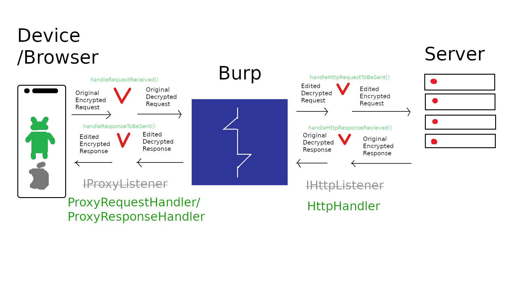

# Burp Custom Crypto Extension

This is a Burp extension template for intercepting communications that use custom cryptography to obfuscate requests and
responses, such as using AES with hard coded keys or signed messages.

It's based on a prior MWR extension written by Darryl Meyer, and ported to the new Burp Montoya API. Where Montoya class
names are mentioned, the similar old Wiener API classes are included in square brackets. This extension works on both Burp Suite Community Edition and Burp Suite Professional.

## Why use this? What makes this better than writing my own extension from scratch or using one from the BApp Store?

While the Burp BApp Store has extensions such as AES Killer, AES Payloads and Decompressor which handle AES and compression in requests, these extensions only do one thing each (AES, compression) and don't handle truly custom cryptography implementations. For more advanced implementations, such as my [custom crypto example webapp](https://github.com/MWR-CyberSec/custom-crypto-example-webapp) intended to be used with this extension, you will likely need to write your own code to convert requests and responses into something usable. Custom problems require custom solutions, after all. In that case, it is easier to use existing code than to start from scratch, no?

One common method for writing extensions required you to write a new class
for every Burp feature you wanted to add. For example, if you wanted to use repeater and proxy, you'd use an
`UserInterface.registerSuiteTab()`[`IMessageEditorTab`] to have a decrypted message tab
(this is generally the feature you'd want to use the most).
If you wanted to use intruder, you'd use `PayloadProcessor`[`IIntruderPayloadProcesser`], if you wanted to use scanner
(which we at the old MWR ZA office hadn't managed to do until my prior extension development),
you'd use `ScanCheck`[`IScannerListener`], etc. Using session handlers, sequencer,
etc. would likely take even more time.

This extension uses `ProxyRequestHandler`,`ProxyResponseHandler`[`IProxyListener`] and `HttpHandler`[`IHttpListener`]
to transparently decrypt requests and encrypt responses so that none of Burp's tools (except proxy) ever see an
encrypted request. This makes it faster to write a usable extension, and
has the added benefit of making testing significantly easier from a usability perspective. Instead of seeing
`data=A89eKFYtrA0dgHJkQIzE%2B4Yqa8Hnx3FKM5KPCLbNBuzAWwy5riAidoT3XT%2BE3r9ztPDqIVis7pnSH1%2Fs56wn3A%3D%3D`
in all your history, you'll see plaintext in all the tools.

## Usage

Using this extension will require some code modifications, as well as some understanding of the classes used by
Burp extender. The crypto is custom after all ;). Documentation for the Burp Montoya Extender API can be found at
[Portswigger's Javadoc](https://portswigger.github.io/burp-extensions-montoya-api/javadoc/burp/api/montoya/MontoyaApi.html). Additionally, this only works on Burp 2023.1 and later, so please make sure that Burp Suite is up to date.

Once you've written the code to do what you want, you can simply build it using Maven.
Once you've imported it, add the targeted host or endpoints to your project scope, you're done (assuming your code works first try. Good luck :D). You can add requests, directories or hosts to the project scope either by
right-clicking a request or response from the Proxy > Intercept or HTTP history tabs and selecting "Add to scope", or
doing the same from the Target > Site Map tab, or through the Target scope settings. Once that's done, all your requests and responses
(once added to the project scope) will be transparently encrypted, decrypted, signed, verified, hashed, rotated,
whatever you need to do.

### Code modification

The starting point for any Burp extension is a class that implements the `BurpExtension` interface [`IBurpExtender`].
In this extension's case, the `CustomCrypto` class. This class allows you to register all the
components your extension will use. If your only use case is encrypting requests and responses, then the existing
`CustomCrypto` implementation should suffice.

You'll be modifying the `CustomCrypto` class to do what you need. The `Proxy` class will allow you to register the
`ProxyRequestHandler`s and `ProxyResponseHandler`s needed to handle the modifications, and the `HTTP` class will allow
you to register the `HttpHandler`. The `ProxyRequestHandler`s and `ProxyResponseHandler` interfaces allow modification
of requests and responses for the proxy tool, which we'll use to transform data going between the client and Burp.
The `HttpHandler` allows us to transform the requests and responses between Burp and the server. The
bad paint drawing below should demonstrate this in a clearer way:

Specifically, the `handleRequestReceived()`, `handleHttpRequestToBeSent()`, `handleHttpResponseReceived()` and
`handleResponseToBeSent()` methods are what you'll use to process requests and responses. In the old Wiener API,
the `IHttpListener.processHttpMessage()` and the `IProxyListener.processProxyMessage()` methods would be used.

The `CryptoOperations` class has some pre-made classes to handle your standard crypto operations,
and the `Persistence` interface can be used for apps that used fixed keys, IVs or other values.

### Compilation and Importing

To build this, simply use `mvn package`. The final `.jar` file will be in the `target` folder. Thanks to Portswigger
for integrating the Montoya API packages into Maven and Gradle, as this makes setting up a build much simpler than
before!

Once that's done, load the `.jar` file as an extension, and you're off to the races!

### Using the extension

If you've implemented your code correctly and added the necessary endpoint to the target scope, everything in-scope in Burp will be decrypted and it'll look and feel like a standard non-crypto app.

I've written a [custom crypto example webapp](https://github.com/MWR-CyberSec/custom-crypto-example-webapp) that you can
use this extension with, without modification. Remember to add the `/login` endpoint to your scope.

Take care when using this extension with other extensions that parse or alter requests and responses, as the load order
matters.

## Contributing

Feel free to submit a pull request to change anything here. I will look at any PRs and I am open to suggestions to make
this better or easier to use.
